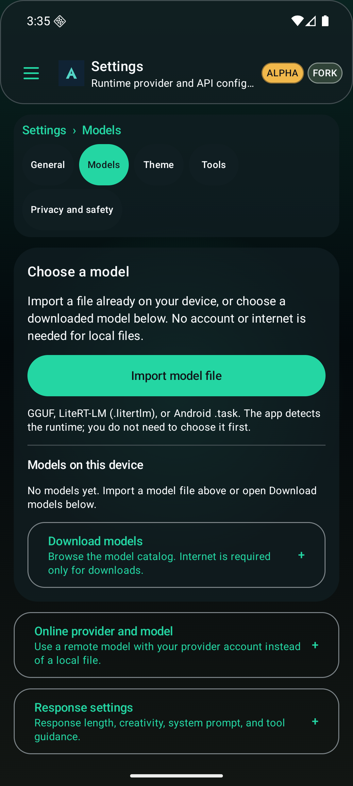
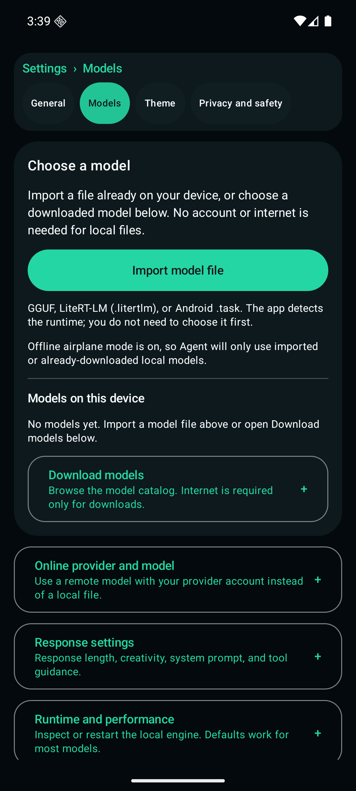

# Agent PR #22 — additive follow-up qualification

This follow-up builds on `ea5167b2d85119a6f4846dbdc2f53b748452c3ca` rather than replacing the existing Agent implementation. The tested application source is `76bf670451725ad0b53636f423476f6acf45b179`.

## Changes

Local-model imports now use interruptible background I/O, check cancellation before and after provider reads, and check again before publication. Cancelling the ViewModel cannot silently carry on an interruptible copy. The original staging-file, duplicate-name, short-lock, rollback and original-file protections remain intact. Cancellation observed after a successfully committed import cannot retroactively undo that completed import; an OS provider that ignores interruption remains outside Java thread-cancellation guarantees.

Response settings now precede engine tuning. Offline-mode and keyword-highlighting switches and the text-size slider expose their purposes to accessibility services. A development-only Compose test host is declared for the custom Play-debug build type; release dependencies are unchanged. The package verifier requires an explicit `--allow-debug-test-host` option, an explicitly debuggable APK and exactly the known bare test activity. The default/release path still rejects that activity, and regression tests reject release manifests, alternate components, duplicates and extra intent filters. New tests exercise file-copy interruption, duplicate admission, ViewModel teardown, navigation restoration, disclosure restoration, translated accessibility state, and a 320 dp / 1.5× text layout.

## Executed validation

| Gate | Result |
| --- | --- |
| Full JVM regression suite, Linux exact source | 1,048 passed; zero failures/errors/skips |
| Play-scoped JVM and import regressions | 26 passed; zero failures/errors/skips |
| Android Python canonical isolated-file suite | 896 passed; zero failures; one skipped; 59 files |
| Installed Full APK UI | 7 passed |
| Installed Play APK UI | 6 passed |
| Native Full and Play APK/test APK builds | Passed without the native-assets skip flag |
| Full package payload / genuine Python bundle verification | Passed |
| Play debug permission/component/package validation | Passed with the explicit, debuggable-only test-host qualification option |
| Full and Play lint | Passed against the existing, unchanged baseline; 57 / 60 warnings remain |
| Live Google Maven stable-version check | LiteRT-LM Android 0.17.1 matches the latest stable artifact |
| Fresh installation and ordinary launcher start | Passed for each edition on the isolated Android 36 x86_64 emulator; no package precompilation or verifier bypass |

The Full installed test run used source `bff93d5935db5e596787e83fa1bfb08a059bb0dd`. The subsequent commit changes only the JVM lifecycle test's synchronization. Rebuilding at the final commit produced **byte-identical Full app and instrumentation APKs**, verified by SHA-256. Final Full and Play JVM tests ran at the runtime source. The Python suite ran at qualification commit `232fcfbf598d68b58cd25c2be6f10aaac567de6e`, which changes only the Play package verifier, its seven new negative/positive tests, and the debug CI invocation; no application or instrumentation code changed.

The first Play launcher command mistakenly targeted the Full-only activity. That command failed and is not counted as a successful launch. The corrective fresh-install run resolved `.play.PlayActivity` from the actual installed manifest, then repeated all six Play UI tests. An earlier Linux test also exposed a race in the test itself between the provider's cleanup and the coroutine's Main-thread finalizer; both are now awaited explicitly. These intermediate results remain in the local operational logs.

Machine-readable [results and exact APK hashes](summary.json), [per-suite counts and XML hashes](junit-ledger.json), [Full UI transcript](full-ui.log), [Play UI transcript](play-ui.log), [Full launch](full-fresh-launch.log), [Play launch](play-fresh-launch.log), [Full package verifier](full-package.log), and [Play package verifier](play-package.log) are attached. Review log copies normalize line endings/trailing whitespace only; raw and normalized hashes are recorded. Private emulator logcat is not published.

## Visual inspection

The actual installed Full app shell opens Models with local import visible before provider or tuning controls. The fixed navigation stays separate from scrolling content. The automated installed tests also capture every supported language and exercise large text without overlapping the navigation.

## Handoff and limits

These are **debug-signed validation builds**, version 0.13.146 / code 144690, not a production-signed release. Full and Play share `com.mobilefork.hermesagent` and cannot coexist as separate installs. Use a separate test device/profile with backed-up data; do not remove an existing production installation just to make a debug signature install succeed.

The owner retains physical-device GGUF/LiteRT-LM inference, memory, GPU/NPU performance, TalkBack interaction and production-signed upgrade testing. Passing emulator UI or package checks does not claim model inference on a phone. The debug CI invocation now explicitly qualifies its test host. Production release, hosted-check completion, store publication, repository renaming, and legal trademark review remain separate steps. Required attribution remains unchanged.

Existing hosted-check blockers reported on PR #22 include repository Actions billing and the optional Claude workflow's missing API/OAuth secret. The repository-wide security audit is separate from this settings follow-up and is not represented as cleared. No secrets, billing settings, workflow protection, merge or release were changed.
